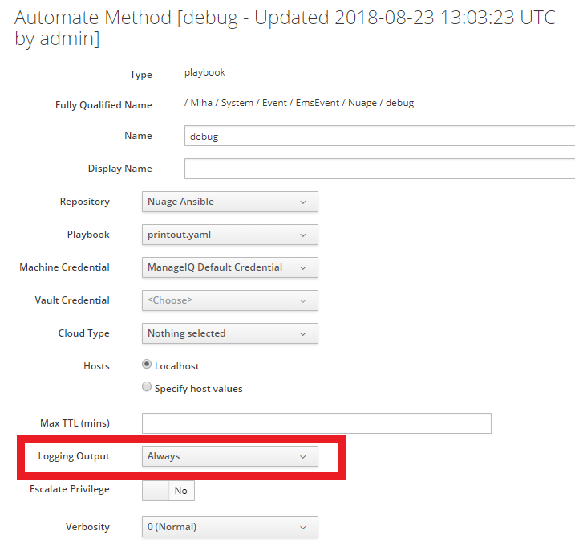
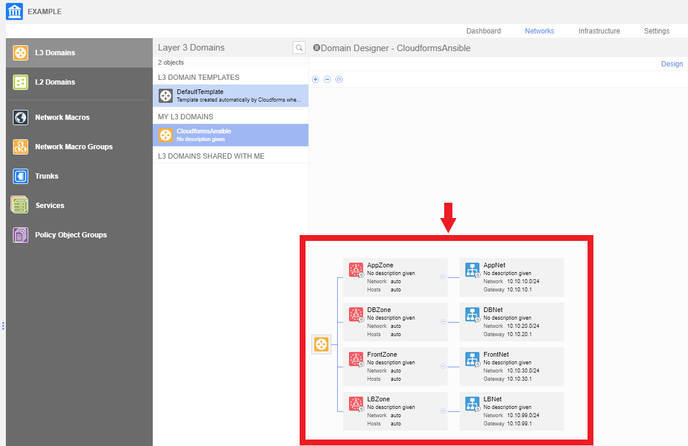

# Nuage Ansible Playbooks
This repository contains example Ansible playbooks that demonstrate how to
approach to Nuage EMS-event-driven Automation. Purpose is to help you get
started writing your own playbooks in a form that they can be triggered by
CloudForms Automation Instances.

## Prerequisites
### Dependent pip packages
If your playbook depends on any pip package, you'll need to install it to appliance
upfront or else playbook execution will error. Run the playbook listed below against
your appliance(s) to do so.

[install-dependencies.yaml](./install-dependencies.yaml)

### Dependent roles
If your playbook depends on external roles, you need to list them in

```
$PROJECT_ROOT/roles/requirements.yml
```

*NOTE: The roles/ directory **MUST** to be on top level of your repository, it cannot
be nested in order for Embedded Ansible to automatically install it for you.*

Embedded Ansible is smart enough to have them downloaded for you, please read
[official documentation](https://docs.ansible.com/ansible/devel/reference_appendices/galaxy.html#installing-multiple-roles-from-a-file)
on exact format of this file. It's best if you use roles published
to [Ansible Galaxy](https://galaxy.ansible.com/) portal, but it's not required.

As a last resort, you can manually bundle your roles in the roles/ directory:

<pre>
$PROJECT_ROOT/roles/<b>your_role</b>
</pre>

## Example playbooks
### EX01: Playbook for Debugging
Printout playbook that does nothing but prints out the `nuage_auth` and `event` variables.
Both of them are set by [xlab_si.nuage_miq_automate][] role. Output will appear in `evm.log`.
 
[printout.yaml](./printout.yaml)

This playbook requires no additional pip packages. 

*NOTE: Make sure you set **Logging Output** to **Always** or else playbook's output will
be suppressed by MIQ. **Verbosity** can be left to **0 (Normal)_**, though:*



### EX02: Another playbook for debugging
One more debug playbook that doesn't do anything useful yet. Similarly as the previous one
it prints the `nuage_auth` and `event` variables. In addition, it performs API request to
the Nuage server (using `nuage_auth` credentials) to fetch entity by ID. Both entity
type and ID are retrieved from payload of EMS event that triggered the execution.

[printout-and-fetch-entity.yaml](./printout-and-fetch-entity.yaml)

This playbook requires **vspk** pip package installed on appliance, read the Prerequisites
section to learn how to do it. 

### EX03: Create DomainTemplate upon Enterprise CREATE
Finally a more real-world scenario playbook.

Following playbook creates a Nuage DomainTemplate with some ZoneTemplates and
SubnetTemplates and instantiate it. Playbook is supposed to be triggered upon
`nuage_enterprise_create` event in CloudForms.

[nuage_enterprise_create-domain-template.yaml](./nuage_enterprise_create-domain-template.yaml)

Notice how we make use of 
[xlab_si.nuage_miq_automate][]
role to access Nuage credentials and event payload.

#### Expected Result
When we create a new Enterprise _EXAMPLE_, the playbook should create following
structure:
 


[xlab_si.nuage_miq_automate]: https://galaxy.ansible.com/xlab_si/nuage_miq_automate

## License
BSD
